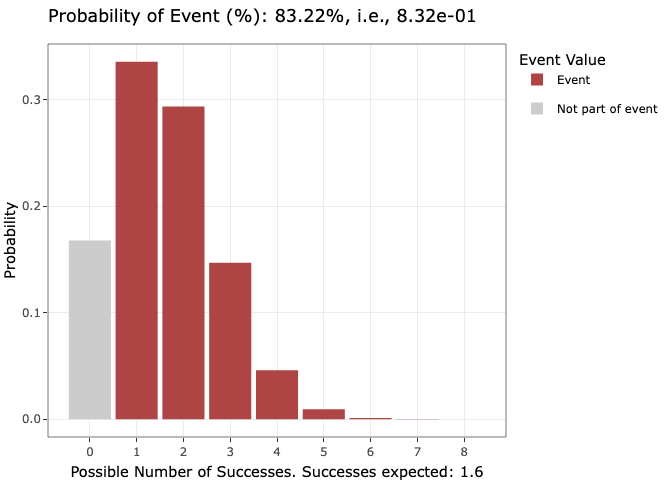
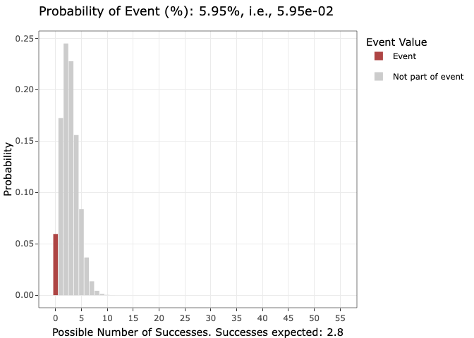
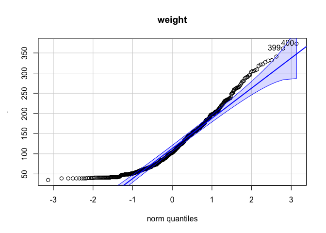
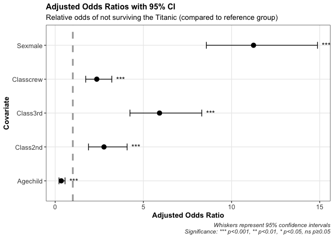
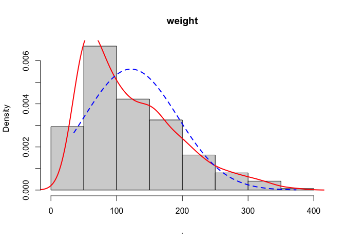
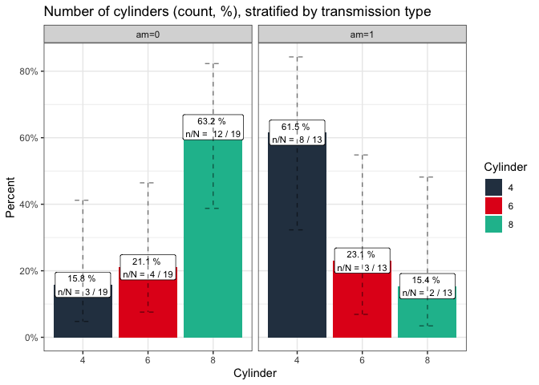

# jamesmisc: Miscellaneous Functions

Welcome friends! This is the homepage for `jamesmisc`, my R package of a
handful of miscellaneous functions.

Hopefully some of these functions will be useful to you as well.

## Installation

You can install the development version of jamesmisc from GitHub with:

``` r
# install.packages("remotes")
remotes::install_github("jcutlerbiostats/jamesmisc")
```

## Usage

`jamesmisc` includes `annuity_n_rates()`, which can calculate and
display growth curves of an investment (say, a retirement plan), with
fixed annual contributions, at different annual rates of growth:

``` r
library(jamesmisc)

list_data_and_plot <- annuity_n_returns(
  initial_investment = 20000, # The initial investment
  annuity = 10000,            # The annual contribution, starting the year after the initial investment
  years = 30,                 # The time over which the investment grows
  return_rates = c(.06,.07,.08,.09,.1) # The annual return rates to visually compare (.06 = 6% annual return)
)
```

Unfortunately, the plot output isn’t visible here on the README, but it
is visible in the function reference page!

``` r
list_data_and_plot[[1]]
```



It includes `binomial_dist()` if you want to compute and visualize the
probability of any event in a binomial experiment. For example,

If I apply to 8 schools, each with an acceptance rate of 20%, what is
the probability that I get into at least one of them?

(As above, the plot output isn’t visible here on the README, but it is
visible in the function reference page!)

``` r
# 8 schools; 20% chance of success (acceptance) for each; at least one acceptance means include the possibility of 1 success and every possibility of a higher number of successes, up to 8 (so)
binomial_dist(
  n_trials = 8,            # 8 is the number of "trials" in the binomial experiment
  prob = .20,              # 20% is the chance of success for each trial
  tail_cutoff = 1,         # 1 success is where the tail/portion of the distribution representing the 'event' stops
  left_or_right = "right"  # It's the right tail/portion of the distribution (every possibility >= 1 success)
) 
```



Or,

55 people received a particular surgery and were followed up to see if
they later regretted it. Zero regretted it. If you were expecting 5% of
them to regret it, under that assumption what was the probability that
no more than zero would end up regretting it?

(Also, not visible here on the README, but the plot is visible in the
function reference page.)

``` r
# 55 people get the surgery; it was expected beforehand that 5% would regret the surgery; zero people actually ended up regretting it; zero "or less" is the tail/portion of the binomial distribution that we're interested in, then--so, the left tail.
binomial_dist(55,.05,0,"left")
```



It includes `check_normality()` if you want to quickly assess normality
of a variable with a qq-plot, a Shapiro-Wilk test of normality, and also
visualize the distribution of the variable in a histogram with a normal
curve super-imposed:

(Plots are visible on the corresponding function reference page.)

``` r
# Assess whether chicken weight, in the ChickWeight dataset, is approximately normally distributed
check_normality(ChickWeight,"weight")
```






        Shapiro-Wilk normality test

    data:  myvar
    W = 0.90866, p-value < 2.2e-16

There is also `plot_logistic_results()` for plotting the adjusted odds
ratios and 95% CI from a multivariable logistic regression analysis:

(Plot can be viewed on the function reference page.)

``` r
library(dplyr)
```


    Attaching package: 'dplyr'

    The following objects are masked from 'package:stats':

        filter, lag

    The following objects are masked from 'package:base':

        intersect, setdiff, setequal, union

``` r
# Let's model survival in the Titanic disaster by regressing it on sex, age group (child/adult), and class. 
data("Titanic")

titanic_tbl <- Titanic %>%
  tibble::as_tibble() %>%
  tidyr::uncount(n) %>%
  mutate(
    Survived = factor(Survived,levels = c("Yes","No")) %>% as.numeric(),
    Survived = Survived - 1,
    Survived = factor(Survived)
  )

titanic_fit <- glm(
  Survived ~ Sex + Age + Class,
  data = titanic_tbl,
  family = binomial
)

# Visualize the adjusted odds ratios and 95% confidence intervals in a dot-whisker plot
plot_logistic_results(
  titanic_fit,
  subtitle = "Relative odds of not surviving the Titanic (compared to reference group)",
  log_scale = FALSE # The default is TRUE (set the x axis to a log scale rather than linear scale)
)
```

    Scale for x is already present.
    Adding another scale for x, which will replace the existing scale.



There’s `strat_proportion_plot()`, which is for plotting the counts and
percentages of a categorical variable stratified by another categorical
variable, in a dataset:

(Plot can be viewed on the function reference page.)

``` r
# Visualize counts and percentages of the engines with different numbers of cylinders, stratified by transmission
strat_proportion_plot(
  data    = mtcars, # Your dataset
  row_var = cyl,    # The 'row' variable in your dataset: In this case, number of cylinders (4, 6, or 8)
  col_var = am,     # The 'column' variable in your dataset: In this case, transmission type (stick or automatic - 1 or 0)
  x_label = "Cylinder",
  plot_title = "Number of cylinders (count, %), stratified by transmission type"
)
```


And there’s a function, `taxes()`, for getting a sense of what your net
income should be, given a gross income. It calculates your federal and
state taxes if you live in California or Oklahoma. And only for married
filing jointly. Sorry, that’s all I have for now.

``` r
taxes(
  80000,            # e.g., $80,000 gross income
  state_name = "OK" # Can switch to 'CA' for California
) %>% glimpse()
```

    Rows: 1
    Columns: 10
    $ Gross_Income       <dbl> 80000
    $ Tax_Filing         <chr> "Married"
    $ Fed_Top_Marginal   <chr> "0.12, 19901, 0.751"
    $ State_Top_Marginal <chr> "0.0525, 15001, 0.812"
    $ Fed_Taxes          <dbl> 9201.88
    $ State_Taxes        <dbl> 3807.297
    $ SocialSec_Medicare <chr> "4960, 1160"
    $ Prop_Taken         <dbl> 0.2391147
    $ Net_Income         <dbl> 60870.82
    $ If_No_State_Tax    <dbl> 64678.12

And there are other dinky little functions as well. Enjoy!
